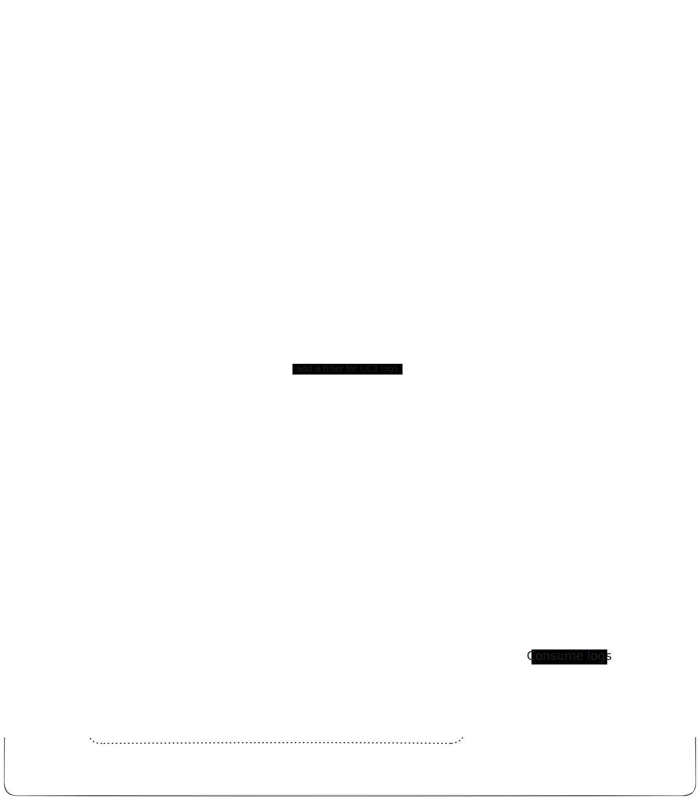

# Engodo 🎣

> [!WARNING]
> WIP: This repository is a work in progress and is not yet ready for production use.

Welcome to **Engodo**! This repository helps you deploy decoy resources (honeypots) across multiple cloud environments (GCP, AWS, Azure) using Terraform. The primary goal is to attract potential attackers, monitor their interactions, and alert you when suspicious activity is detected. This enables a proactive approach by allowing you to detect and respond to threats before they escalate.

[more details about the project here](https://tentwentyone.atlassian.net/wiki/spaces/CCOE/pages/211976216/Engodo)

## Table of Contents 📖

- [Introduction](#introduction)
- [Features](#features)
- [Getting Started](#getting-started)
- [Repository Structure](#repository-structure)
- [Prerequisites](#prerequisites)
<!-- - [Usage](#usage) -->
  <!-- - [Setup Decoy](#setup-decoy)
  - [Watch Decoy Logs](#watch-decoy-logs)
  - [Create Event on Interaction](#create-event-on-interaction) -->
- [Modules](#modules)
  - [AWS](#aws)
  - [GCP](#gcp)
  - [Azure](#azure)
- [Common Variables](#common-variables)
- [Contributing](#contributing)
- [License](#license)

## Introduction 🚀

**Engodo** allows you to deploy decoy resources in GCP, AWS, and Azure to attract and monitor potential attackers. It is divided into three main modules, each module in this repository is designed to deploy and manage honeypots in a cloud-agnostic manner, making it easy to set up, monitor, and react to interactions across different cloud providers.

## Features ✨

- **Multi-cloud support**: Deploy honeypots in GCP, AWS, and Azure.
- **Terraform-based**: Leverage Terraform for consistent infrastructure deployment.
- **Modular structure**: Separate modules for each cloud provider whilhe sharing most of the configuration.
- **Monitoring**: Watch logs and forward them to any system capable of consuming from a pub/sub topic.
- **Ease of use**: Common setup variables across modules.

## 📁 Repository Structure

**Engodo** is segmented into three modules, each dedicated to a specific cloud provider:

Each module contains the necessary documentation and Terraform configuration files to deploy honeypots in the respective cloud environment. The modules share a common set of configuration variables to facilitate cross-cloud usage.

## Workflow 🔄

1. **Setup Decoy**: Deploy honeypots resources in the cloud environment of your choice.
2. **Decoy Interaction Logs**: logs generated by interactions with the honeypots resources are sent to a Pub/Sub topic.
3. **Alert**: Configure an external service to consume logs from the Pub/Sub topic and trigger alerts based on the interactions.

## Architecture 🏗️

The architecture of Engodo is designed to be modular and cloud-agnostic, allowing you to deploy honeypots in GCP, AWS, and Azure using a consistent configuration. The following diagram illustrates the high-level architecture of Engodo:

> Insert architecture diagram here

The architecture consists of the following components:

- **Terraform Configuration**: Contains the Terraform configuration files divided into modules for deploying honeypots in GCP, AWS, and Azure.
- **Decoy Resources**: Honeypot resources deployed in the cloud environment to attract potential attackers.
- **Logging Services**: Cloud-native logging services to monitor interactions with the decoy resources.
- **Event Services**: Cloud-native event services to temporarily store and provide access to external services for processing logs.

The architecture is designed to be flexible and extensible, allowing you to customize and enhance the functionality based on your requirements.

### GCP Architecture

The architecture for deploying honeypots in GCP consists of the following components:

- **Decoy Resources**: Honeypot resources deployed within Google Cloud Platform (GCP) to mimic actual system assets.
- **Log Sink**: A sink that collects and exports logs from the decoy resources to a Pub/Sub service, ensuring secure and efficient logging.
- **Pub/Sub Topic**: A temporary storage for logs received from the Log Sink, enabling them to be processed and analyzed by external services before being permanently stored or deleted.
- **Pub/Sub Subscription**: A subscription that enables external services to consume and process the logs temporarily stored in the Pub/Sub topic.

## Getting Started 🛠️

To get started with Engodo, you'll need to have Terraform installed and properly configured for your cloud environments. Follow the instructions below to set up and deploy your first decoy resource.

## Prerequisites 📋

- Terraform v1.0 or higher
- Accounts with sufficient permissions in GCP, AWS, and/or Azure
- Configured CLI tools for your cloud providers (gcloud, awscli, azcli)

<!-- ## Usage 📝 -->

<!-- ### Setup Decoy

Watch Decoy Logs 📑
After deployment, you can monitor the logs of the deployed decoy resources using the logging services provided by the respective cloud providers:

AWS: CloudWatch
GCP: Stackdriver
Azure: Azure Monitor
Create Event on Interaction 🔔
Configure your environment to trigger events based on interactions with the decoy resources. This can be done using the event services of the respective cloud providers:

AWS: CloudWatch Events or EventBridge
GCP: Pub/Sub or Cloud Functions
Azure: Event Grid or Azure Functions
Modules 📦
AWS
Terraform module to deploy and manage honeypots in AWS.

Detailed documentation for AWS module

GCP
Terraform module to deploy and manage honeypots in GCP.

Detailed documentation for GCP module

Azure
Terraform module to deploy and manage honeypots in Azure.

Detailed documentation for Azure module -->

## Common Configuration Variables 🛠️

The following variables are common across all modules to facilitate cross-cloud usage:

<!-- - `resource_prefix`: A prefix for naming the resources.
- `topic_name`: Name of the Pub/Sub topic or SNS topic for sending alerts. if not specified, no alerts will be sent.
- `alert_email`: Email address for sending alerts. if not specified, no alerts will be sent.
For a complete list of variables, refer to the documentation of each module. -->

## Use cases 📦

| Use Case | Description | Events | GCP | AWS | Azure |
| --- | --- | --- | --- | --- | --- |
| 1. Unauthorized Bucket Access | Detect when someone attempts to access a bucket object they shouldn't access | storage.objects.get   storage.objects.update   storage.objects.create    storage.objects.delete |  ✅ | 🚧 | 🚧 |
|2 . Malicious Assume SA | Identify who's trying to assume a decoy service account and what actions they try to perform with the SA | iam.serviceAccounts.getAccessToken   google.iam.admin.v1.GetRole | ✅ | 🚧 | 🚧 |
| 3. Unauthorized Secret Store Access | Flag attempts to access decoy secrets that should never be accessed | secretmanager.v1.SecretManagerService.EnableSecretVersion   secretmanager.v1.SecretManagerService.AddSecretVersion   secretmanager.v1.SecretManagerService.DisableSecretVersion   google.iam.admin.v1.GetPolicyDetails   location.Locations.GetLocation   location.Locations.ListLocations   secretmanager.v1.SecretManagerService.GetIamPolicy   secretmanager.v1.SecretManagerService.GetSecret   secretmanager.v1.SecretManagerService.GetSecretVersion   secretmanager.v1.SecretManagerService.ListSecretVersions   secretmanager.v1.SecretManagerService.ListSecrets   secretmanager.v1.SecretManagerService.CreateSecret   secretmanager.v1.SecretManagerService.DeleteSecret   secretmanager.v1.SecretManagerService.DestroySecretVersion   secretmanager.v1.SecretManagerService.SetIamPolicy   secretmanager.v1.SecretManagerService.UpdateSecret   secretmanager.v1.SecretManagerService.AccessSecretVersion | ✅ | 🚧 | 🚧 |

## How much time does it take to alert on an event? ⏰

The time it takes to alert on an event depends on the cloud provider and the services used. Here's a rough estimate of the time it takes since the event to receiving the log on pub/sub:

- **GCP**: 1-2 seconds
- **AWS**: X seconds
- **Azure**: X seconds

## Helpfull links 📚

- [AWS Blog - How to detect suspicious activity in your AWS account by using private decoy resources](https://aws.amazon.com/pt/blogs/security/how-to-detect-suspicious-activity-in-your-aws-account-by-using-private-decoy-resources/)
- [Zscaler Cloud Deception - usefull information about cloud deception within cloud environments](https://help.zscaler.com/deception/deceive/cloud-deception)
- [Qeeqbox: Honeypots - honeypots for multiple protocols in a python package](https://github.com/qeeqbox/honeypots)
- [Telekom Security: T-potce - all in one honeypot based on docker](https://github.com/telekom-security/tpotce)
- [SpaceSiren - honeypot for AWS access keys](https://github.com/spacesiren/spacesiren)
- [IMDSpoof - spoof and serve fake IMDS metadata](https://github.com/grahamhelton/IMDSpoof)
- [AWS-Mine - Identical to spacesiren but with more features](https://github.com/StevenSmiley/aws-mine)
- [Heidelberg University - Honeypot Implementation in a Cloud Environment](https://arxiv.org/pdf/2301.00710)

## Contributing 🤝

We welcome contributions! Please read our CONTRIBUTING.md file (TBD) for details on the code of conduct, and the process for submitting pull requests.

## License 📄

This project is licensed under ???

Feel free to adjust the repository links and additional details as necessary. You can also add more sections to the README to provide more information about the project, such as troubleshooting tips, advanced configurations, or security considerations.
